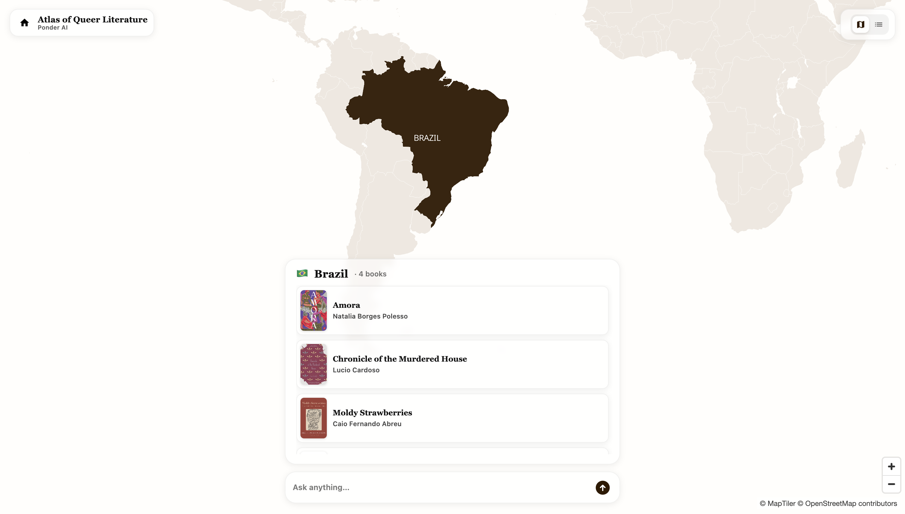
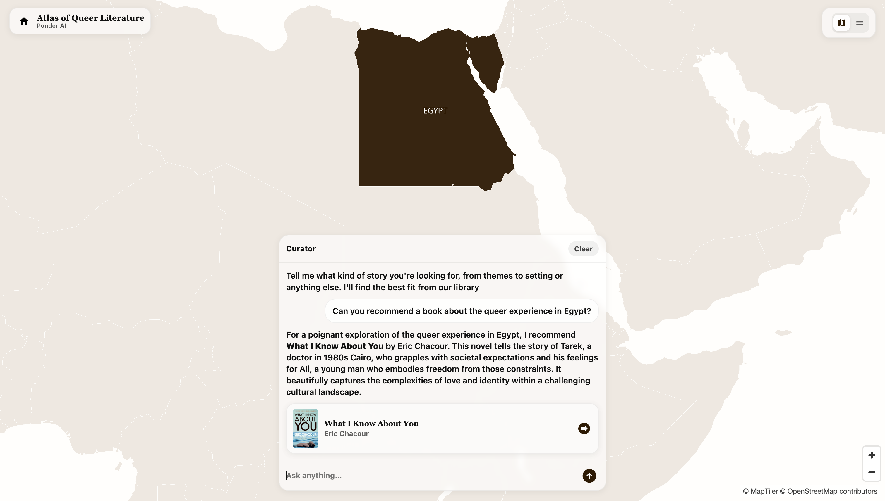
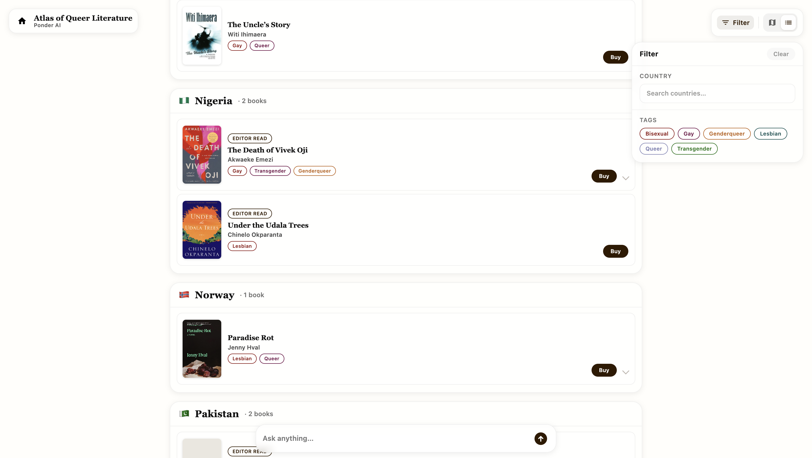

# Atlas

This atlas connects queer readers to queer literature through an interactive map and an AI assistant. The assistant helps readers discover books, authors, and stories that resonate, while the map makes it easy to explore titles from around the world. You can check out the [live map here](https://map.ponder-app.ai).

## Overview

- **AI-guided discovery:** An assistant that helps readers find LGBTQ+ books and authors based on interests, identity, and vibe.
- **Map-first exploration:** Browse literature spatially to surface local voices, settings, and queer communities.
- **Community powered:** Anyone can suggest new books for inclusion. Our current library is based on our own libraries, personal recommendations, and community submissions.
- **AI-driven features:** We used genAI to write summaries about what is specifically queer about the book to help readers know what to expect.

## Preview

**Map:** browse books by country on the interactive map.

**Curator:** ask for recommendations tailored to themes, settings, and identity.

**List:** explore the catalog with country grouping and tag filters.

## Roadmap

Future plans include:

- **Richer book detail pages:** additional metadata, themes, content notes, reviews, and reading levels.
- **Smarter assistant:** better recommendations, improved filtering, and more nuanced guidance.
- **More dynamic mapping:** filters, layers, and smarter geo-grouping.
- **Bigger library:** keep expanding the catalog of queer literature.

## Contributions

If you have books you'd like to add, please use this [Google Form](https://forms.gle/2EAUz7nf3pGPdM8z7) to submit new books.

PRs and suggestions are also welcome! If you have feedback, ideas, or want to help, open an issue or submit a book via the form above.

## Local development

1. Production runtime config lives in `public/config.js` (deployed with Hosting). For local overrides, copy `public/config.example.js`.
2. Serve `public/` with any static server. Book data loads from the `atlasCatalog` Cloud Function (not client Firestore), so local UI works best with emulators or a deployed catalog endpoint in config.
3. Cloud Functions: `cd functions && pip install -r requirements.txt` then deploy or emulate `atlasCatalog` and `atlasChat`.
4. Do **not** deploy `firestore.rules` from this repo if the Firebase project is shared with Ponder — Atlas reads `atlasBooks` via the Admin SDK in Cloud Functions only.
5. Audit missing map pins: `python functions/scripts/audit_country_override.py` (dry-run CSV report).
6. Run function tests: `cd functions && python -m unittest test_atlas_chat.py test_ci_config.py`.
7. Before changing CI or deploy config, read `AGENTS.md` and run `bash scripts/prepare_functions_venv.sh`.
